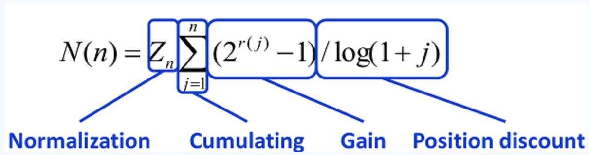
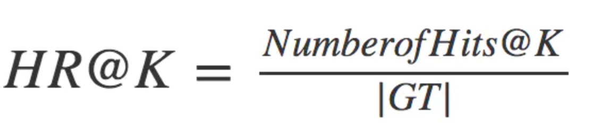
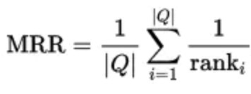
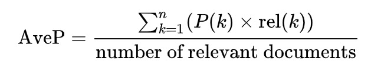

## NDCG (Normalized discounted cumulative gain)

- 确保 质量越好、排名越靠前的得分越高；
- 可以自定义Gain；

## HR (Hit Ratio)

- HR是一种常用的衡量召回率的指标，分母是所有ground truth, 分子是对的个数

## MRR (Mean Reciprocal Rank)

- 第一个对的排名倒数，其中用户的个数，ranki是对于第i个用户，推荐列表中第一个在ground-truth结果中的item所在的排列位置。

## AP (Average precision)

- 平均准确率累加，最后除以总的对的个数(极端情况所有位置准确率都为1);
- P(k), 位置K的准确率; 

## MAP (Mean Average Precision)
- MAP = AP / num_user

